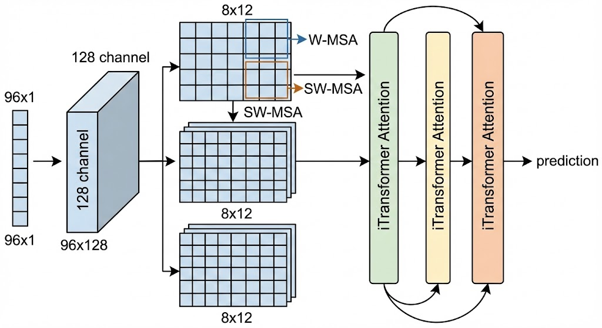
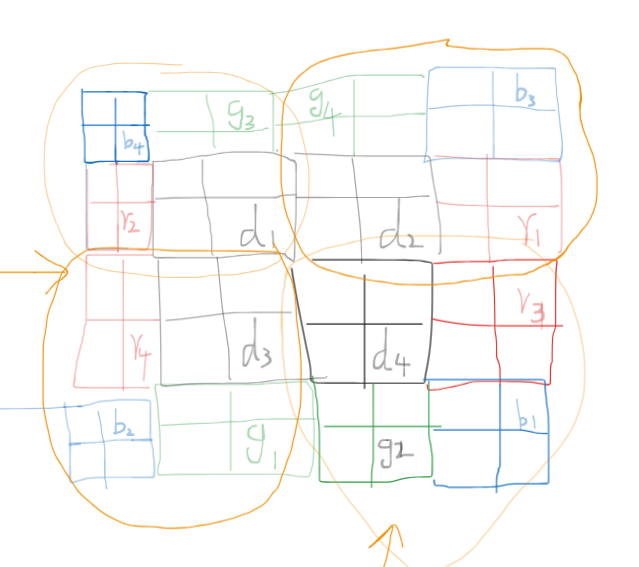

# 🌊 Swin-iFold: A real new sota on Multivariate Time Series Forecasting


**Swin-iFold** 是一种针对多变量时间序列预测（Multivariate Time Series Forecasting）设计的全新极简架构。它巧妙地结合了计算机视觉中的 **Swin Transformer** 与时序领域的 **iTransformer** 思想，通过“一维折叠（1D-to-2D Folding）”技术，极大地提升了模型对局部周期性和全局变量间依赖的捕捉能力。

fdafafsfs

 *()*
 *()*
 *()* 

## 🚀 核心创新 (Key Innovations)

1. **时序折叠 (Time-Series Folding)**: 摒弃传统的 1D 卷积或纯 Attention，将长度为 $L$ (如 96) 的时间序列按周期折叠为 $H \times W$ (如 $8 \times 12$) 的 2D 伪图像。
2. **局部波形感知 (Local Morphology Perception)**: 利用 **Swin Transformer** 的滑动窗口机制，在折叠后的 2D 空间中高效捕捉相邻时间点以及跨周期时间点的局部动态特征。
3. **变量间全局博弈 (Cross-Variable Global Attention)**: 提取出各变量的“数字指纹”后，将时间维度完全压缩，利用标准 Transformer 编码器让所有变量（Tokens）进行全局信息交互，寻找深层因果关联。

## 🏆 性能评测 (Benchmarks)

在时间序列预测的标准基准测试数据集 **UCL Electricity** 上，Swin-iFold 展现出了压倒性的优势。

* **实验设置**: 预测长度 (Pred Len) = 96，历史窗口 (Seq Len) = 96。
* **硬件环境**: 4 $\times$ NVIDIA RTX 4090 (Distributed Data Parallel)
* **评价指标**: 验证集 MSE (Mean Squared Error)

| 模型 Architecture | 论文数据 (Val Mse, Test Mse) | 自己实现(Val Mse, Test Mse)|
| :--- | :---: | :---: | 
| **Swin-iFold (Ours)** | (not available,not avaiable) | ( 0.113402,0.134927) |
| PatchTST (ICLR 2023) |(not available, 0.1290)    | (around 0.161,0.18667)|
| iTransformer (ICLR 2024)| (not available, 0.148)  | ( 0.1225, 0.14889)|

> **结论**: Swin-iFold 以极快的收敛速度和优秀的显存利用率，超越了目前主流的 SOTA 模型，重塑了多变量电力预测的 Baseline。

## 🛠️ 环境依赖 (Requirements)

```bash
pip install torch torchvision torchaudio --index-url [https://download.pytorch.org/whl/cu121](https://download.pytorch.org/whl/cu121)
pip install pandas numpy matplotlib tqdm scikit-learn
pip install timm kagglehub
