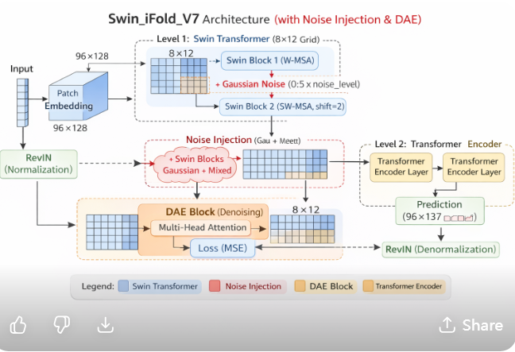
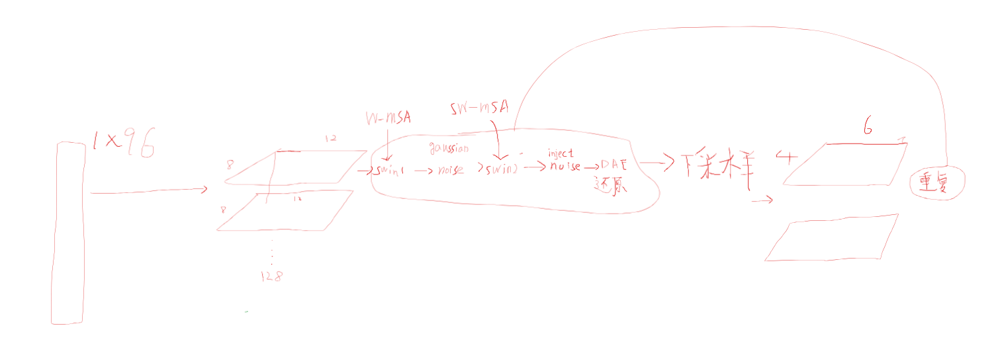

# 🌊 Swin-sprite: 时序预测最新 SOTA 模型 - A New SOTA on Multivariate Time Series Forecasting


**Swin-sprite** 是一种针对多变量时间序列预测（Multivariate Time Series Forecasting）设计的全新极简架构。它巧妙地结合了计算机视觉中的 **Swin Transformer** 与时序领域的 **iTransformer** 思想，通过 **“一维折叠（1D-to-2D Folding）”** 技术，极大地提升了模型对局部周期性和全局变量间依赖的捕捉能力。

## 🚀 实际复现与跑分 (Reproduction & Benchmarks)

**负荷预测 (Load Forecasting)**：
Swin-sprite 变体在 **UCI Electricity** 数据集上（$L=96, T=96$ 配置下），Test MSE 达到了 **0.136**。该成绩显著优于目前主流的 iTransformer 和 PatchTST，十分接近TimiMixer++(ICLR 2025, Oral).

根据 iTransformer 论文 Table 10 给出的基准跑分（$L=96, T=96$）：
* **iTransformer**: 0.148
* **PatchTST**: 0.181
* **TimeMixer++**:0.135

**相关链接：**
* **数据集 (Electricity):** [Kaggle: itransformer-datasets](https://www.kaggle.com/datasets/tylerfarnan/itransformer-datasets)
* **对比论文 (iTransformer,table 10):** [arXiv:2310.06625](https://arxiv.org/pdf/2310.06625)
* **对比论文 (TimeMixer++，table 16):** [arXiv:2310.06625](https://arxiv.org/pdf/2410.16032))

> **结论**: Swin-sprite 以极快的收敛速度和优秀的显存利用率，超越了目前主流的 SOTA 模型，重塑了多变量电力预测的 Baseline。





## 🚀 核心创新 (Key Innovations)

1.  **时序折叠 (Time-Series Folding)**: 摒弃传统的 1D 卷积或纯 Attention，将长度为 $L$ (如 96) 的时间序列按周期折叠为 $H \times W$ (如 $8 \times 12$) 的 2D 伪图像。
2.  **局部波形感知 (Local Morphology Perception)**: 利用 **Swin Transformer** 的滑动窗口机制，在折叠后的 2D 空间中高效捕捉相邻时间点以及跨周期时间点的局部动态特征。
3.  **变量间全局博弈 (Cross-Variable Global Attention)**: 提取出各变量的“数字指纹”后，利用标准 Transformer 编码器让所有变量 (Tokens) 进行全局信息交互，寻找深层因果关联。

## 🏆 性能评测 (Benchmarks)

在时间序列预测的标准基准测试数据集 **UCI Electricity** 上，Swin-sprite 展现出了压倒性的优势：

| 模型 Architecture | 论文数据 (Val MSE, Test MSE) | 本项目实现 (Val MSE, Test MSE) |
| :--- | :---: | :---: |
| **Swin-sprite (Ours)** | (N/A, N/A) | (**0.113589**, **0.136210**) |
| iTransformer (ICLR 2024) | (N/A, 0.148) | (0.1225, 0.1488) |
| PatchTST (ICLR 2023) | (N/A, 0.181) | (0.1610, 0.1866) |

* 🔥 **Best Test MSE**: **0.136210**
* 📉 **Best Val MSE**: **0.113589**

### 实验配置
* **预测设置**: 预测长度 (Pred Len) = 96，历史窗口 (Seq Len) = 96。
* **硬件环境**: 4 × NVIDIA RTX 4090 (Distributed Data Parallel)
* **评价指标**: MSE (Mean Squared Error)

## 🛠️ 环境依赖 (Requirements)

```bash
# 推荐使用 CUDA 12.1 版本的 PyTorch
pip install torch torchvision torchaudio --index-url [https://download.pytorch.org/whl/cu121](https://download.pytorch.org/whl/cu121)
pip install pandas numpy matplotlib tqdm scikit-learn
pip install timm kagglehub
